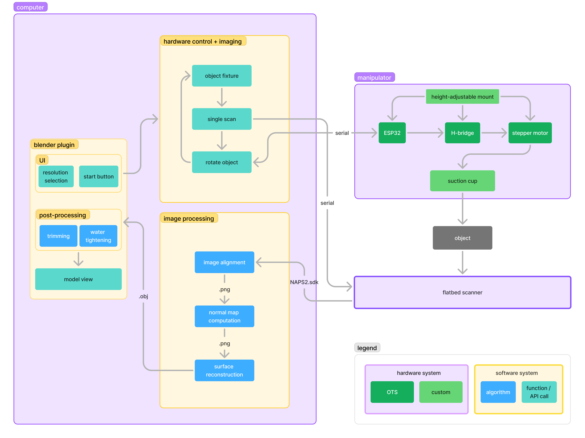

# flatbed-3d-scanning
Using a flatbed scanner to create 3D models

Made at CMU by Theo Cockrell, Sophia King and Yon Maor \
ECE Capstone Project, Spring 2025

# Block Diagram

# Links
[Drive](https://drive.google.com/drive/folders/1ced0EoecR5MyE44IGFHTp-g9Kk1cnlny?usp=drive_link)\
[Overleaf](https://www.overleaf.com/4282792349kjgzvnnsnnzq#f804f3) \
[Miro](https://miro.com/app/board/uXjVLqdlKAg=/?share_link_id=63507211204) (block diagrams) \
[Figma](https://www.figma.com/team_invite/redeem/5x660ntAn8yKOq8LIjZn8b) (design and ideation) \
[Github](https://github.com/yonmaor1/flatbed-3d-scanning)

# References
https://www.cs.ubc.ca/~woodham/papers/Woodham80c.pdf \
https://www.researchgate.net/publication/281105714_Making_3D_Replicas_Using_a_Flatbed_Scanner_and_a_3D_Printer \
https://dl.acm.org/doi/abs/10.1145/3357236.3395579 \
https://kilthub.cmu.edu/articles/thesis/3D_Microscopic_Texture_Interface_in_CAD_Cultivating_Material_Knowledge_for_the_Practiced_Digital_Hand/8234276?file=15351137 \
https://onlinelibrary.wiley.com/doi/epdf/10.1111/1467-8659.00236

# TODO
- everything
